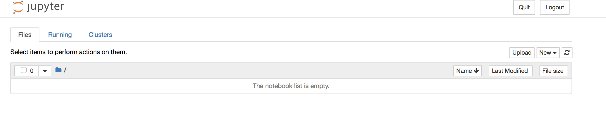
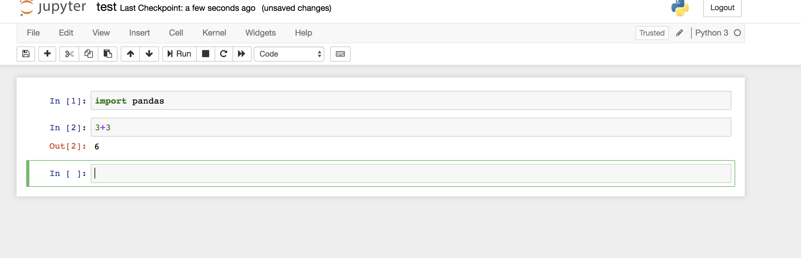

# Chapter 2: A Jupyter-Notebook Server!
We will now write a Dockerfile that generates an image that is fully configured to host a Jupyter notebook server.

Let us again check out the Dockerfile. There seems to be much more going on now! Let us take it step-by-step.

    FROM python:3.7

This one is easy: We start with a system that has Python 3.7 preinstalled. We now run `apt-get update` to make sure our system has updated package lists for everything we want to add to it.

    RUN apt-get update

We now use the `COPY` command: It allows us to copy files from our local machine into the docker image.
In this case, we copy over requirements.txt. This text file contains all Python modules that we need to run a Jupyter notebook server (and it also contains `pandas` and `numpy`).

    COPY requirements.txt .

We now switch the working directory to the folder /jupyter-notebooks (this folder will be created by the `WORKDIR` command).
This is the folder where we want to save our notebooks in.

    WORKDIR /jupyter_notebooks

The following command now installs all modules from `requirements.txt`.

    RUN pip install -r ../requirements.txt

Note that we have to go to the parent folder first before we find `requirements.txt`. It would have been cleaner to run `pip install` before changing the working directory. We wrote this version for educational purposes.

Lastly, we want to actually start the jupyter-notebook server when we spin up a container.

    CMD jupyter-notebook --no-browser --ip="*" --allow-root --NotebookApp.allow_remote_access=True

## Running and storing

Building the image is as easy as it was in chapter 1:

    docker build -t jupyter .

The run command will be trickier - let's dive right into it:

    docker run -p 8888:8888 -v notebooks:/jupyter_notebooks --name jupyter jupyter

We need the option `-p 8888:8888` to connect the container port 8888 with our machine port 8888. The option `-v notebooks:/jupyter_notebooks` mounts the volume `notebooks` to the folder `/jupyter_notebooks`. You ask what is a volume? In order to persists files created in containers, Docker can create volumes. Those volumes can then be attached to one or more containers. If a running container stops, the content of the volume is stored on your machine's hard drive and reloaded if you start the container again. You can think of a volume as a network hard drive that you can attach to many different networks.

Go ahead into the notebook-server (follow the instructions printed on the terminal) and make a notebook. Note that our terminal is actively showing the log of our container. This is useful for debugging but how do we stop the container from running? Let us use the web frontend of the jupyter server to stop the server and regain control over our terminal by clicking the quit button.

Alternatively, we could have used

    docker stop jupyter

to stop the jupyter server.
Use

    docker rm jupyter

to remove the container. If you now rebuild and restart the container, you will notice that the notebook you just created is still there!

In order to test this, use the command

    docker run -d -p 8888:8888 -v notebooks:/jupyter_notebooks --name jupyter jupyter

We are now running it in detached mode, so we do not lose control over the terminal. However, we also do not see the prompt that gives us the address and the authorization token of the jupyter server. We can get it via

    docker logs jupyter

which accesses the logs of the jupyter container. We can now log into the notebook server again and verify that our notebook still exists.

Let us stop the container using

    docker stop jupyter

We can also verify that our volume `notebook` was created successfully via

    docker volume ls

and we can remove it via

    docker volume rm notebooks

This is the end of Chapter 2! We will now continue with building a container hosting a database in Chapter 3.
